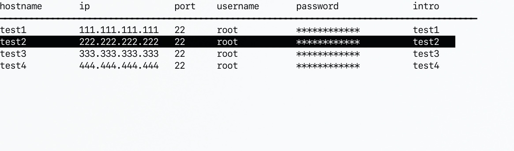
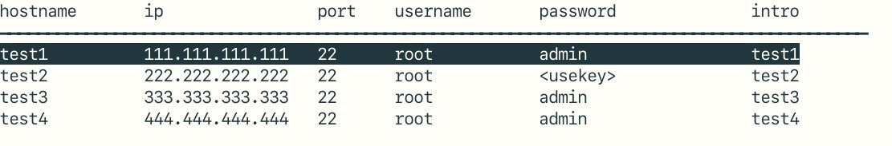

[](https://www.travis-ci.org/number317/ssh-tool)
[](https://sonarcloud.io/dashboard?id=number317_ssh-tool)

# Intro

This is a small tool to manage ssh server info in command line. Write the servers' info down in the config file so that you don't need to remember the servers' ip, password or port.

# Dependency

* libconfig: parse cfg
* ncurse: draw gui
* sshpass: take password form config file

# shortcut

* <kbd>e</kbd>: edit config with `$EDITOR`
* <kbd>j</kbd>: move down
* <kbd>k</kbd>: move up
* <kbd>J</kbd>: next page
* <kbd>K</kbd>: prev page
* <kbd>r</kbd>: reload
* <kbd>G</kbd>: move to last page
* <kbd>$</kbd>: move to last row of current page
* <kbd>0</kbd>: move to first row of current page
* <kbd>1-9</kbd>: move to page 1-9
* <kbd>/</kbd>: search
* <kbd>n</kbd>: search next
* <kbd>N</kbd>: search prev
* <kbd>s</kbd>: toggle password
* <kbd>q</kbd>: exit
* <kbd>Enter</kbd>: connect

# config

The default config file is in `$HOME/.config/ssh-tool/hosts.cfg`, you can also change the file path by `ssh-tool /path/to/config_file`.

config template:

```cfg
header=["hostname", "ip", "port", "username", "password", "intro"];
seperation_char="━"
seperation_length=90;
# how many rows to show in one page
hosts_perpage=30;
hosts=(
        {
        hostname="test1";
        ip="111.111.111.111";
        port="22";
        use_key="false"
        username="root";
        password="admin";
        comment="test1";
        },
        {
        hostname="test2";
        ip="222.222.222.222";
        port="22";
        use_key="true"
        username="root";
        password="<usekey>";
        comment="test2";
        },
        {
        hostname="test3";
        ip="333.333.333.333";
        port="22";
        use_key="false"
        username="root";
        password="admin";
        comment="test3";
        },
        {
        hostname="test4";
        ip="444.444.444.444";
        port="22";
        use_key="false"
        username="root";
        password="admin";
        comment="test4";
        }
      );
```

The config file should have `hostname`, `ip`, `port`, `use_key`, `user`, `password`, `intro` seven part.

If you use identity file to login in, the `password` should be the path of identity file.

# screenshot





# docker

```bash
docker run -it --rm cheon/ssh-tool ssh-tool
```
