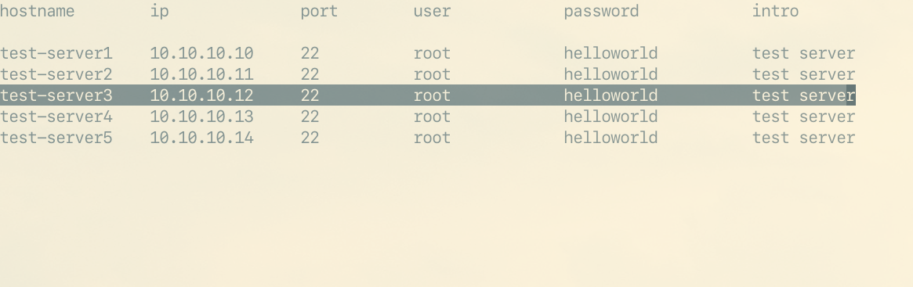

# Intro

This is a small tool to manage ssh server info in command line. Write down the servers' info in the config file so that you don't need to remember the servers' ip, password or port.

# Dependency

* ncurse: draw gui
* sshpass: take password form config file

# shortcut

* <kbd>j</kbd>: move down
* <kbd>k</kbd>: move up
* <kbd>r</kbd>: reload
* <kbd>q</kbd>: exit
* <kbd>G</kbd>: move to last
* <kbd>Enter</kbd>: connect

# config

The config file is in `$HOME/.config/ssh-tool/server.txt`, there is no way to change the position now unless edit the source file.

config template:

```txt
hostname        ip              port        user            password            intro 

test-server1    10.10.10.10     22          root            helloworld          test server
test-server2    10.10.10.11     22          root            helloworld          test server
test-server3    10.10.10.12     22          root            helloworld          test server
test-server4    10.10.10.13     22          root            helloworld          test server
test-server5    10.10.10.14     22          root            helloworld          test server
```

The config file should have `hostname`, `ip`, `port`, `user`, `password`, `intro` six part.

# screenshot


